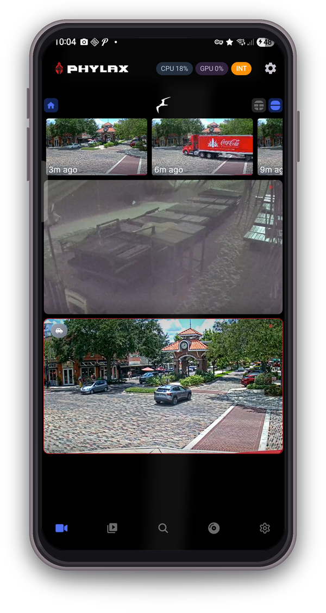
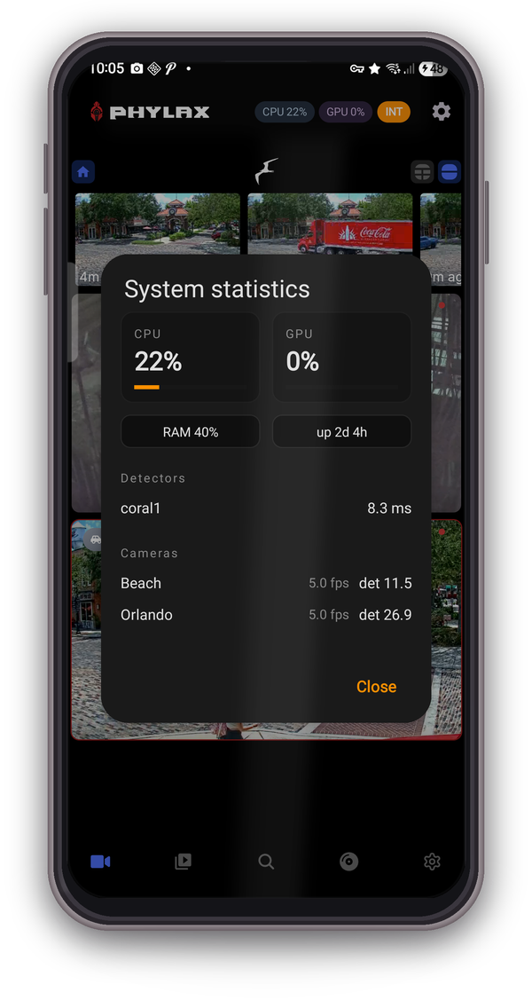
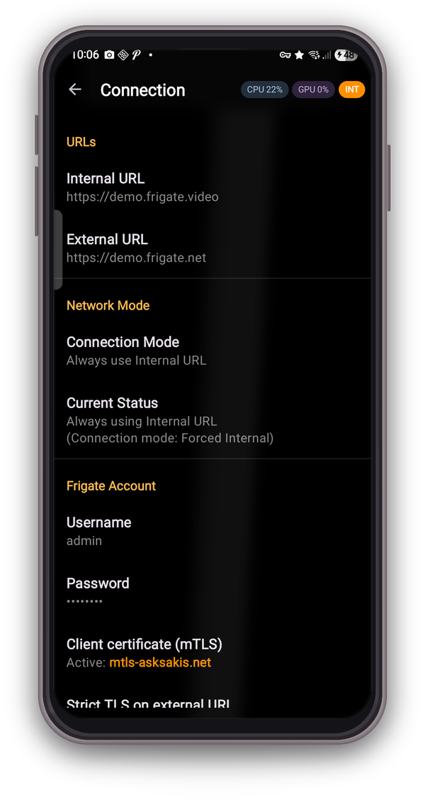
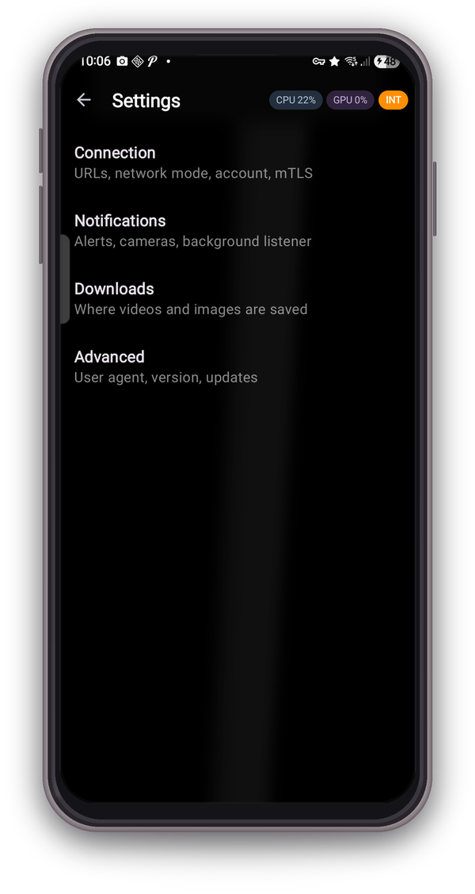
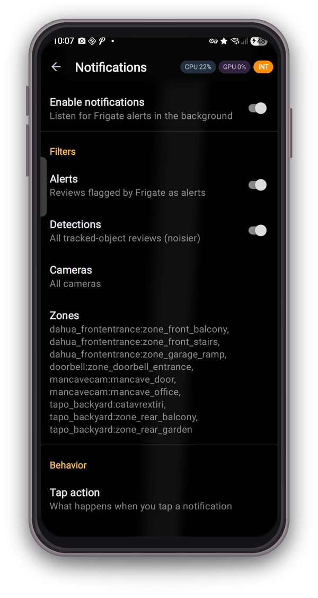
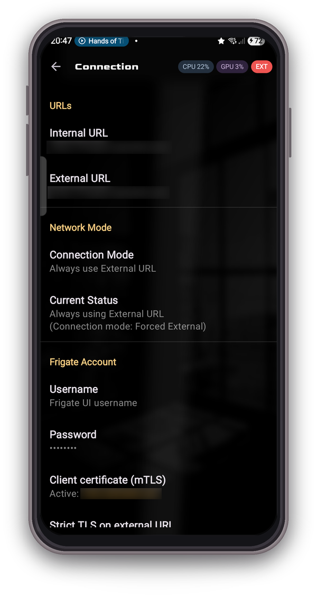

# Frigate Viewer

**A seamless Android client for [Frigate NVR](https://frigate.video/) with smart URL switching and push-like notifications.**

_This app is an unofficial third-party client and is not affiliated with the Frigate NVR project._

---

## Table of Contents

- [What it does](#what-it-does)
- [Screenshots](#screenshots)
- [Install](#install)
- [How URL switching works](#how-url-switching-works)
- [Notifications](#notifications)
- [Live stats](#live-stats)
- [Downloads](#downloads)
- [Deep linking](#deep-linking)
- [Permissions](#permissions)
- [Requirements](#requirements)
- [Privacy](#privacy)
- [Support](#support)
- [License](#license)

## What it does

Frigate Viewer makes your self-hosted Frigate NVR feel like a proper mobile app.

- **Auto-switches between home and remote URLs** based on your Wi-Fi. No VPN, no manual toggles.
- **Reliable push-style notifications** with snapshot thumbnails. Tap a notification and you land right on the event.
- **Live system health at a glance.** CPU and GPU load in the top bar, tap for per-camera FPS and detector inference.
- **Fine-grained notification filters** by camera, zone and severity. One notification per event, never a spam flood.
- **Secure by default.** Supports client certificates (mTLS) for Cloudflare Access / nginx setups, self-signed certs on LAN.
- **Two-way talk** on doorbell and intercom cameras, with the phone's call-quality audio path engaged for clearer voice.

## Screenshots

<table>
  <tr>
    <td align="center"> Home: cameras + live stats</td>
    <td align="center"> System statistics</td>
    <td align="center"> Connection status</td>
  </tr>
  <tr>
    <td align="center"> Settings root</td>
    <td align="center"> Notification filters</td>
    <td align="center"> Connection + mTLS</td>
  </tr>
</table>

## Install

Grab the latest signed APK from the [Releases page](https://github.com/sfortis/frigate-viewer/releases/latest) and install it on your device.

First-run setup:
1. Open **Settings → Connection** and enter your internal URL (e.g. `https://frigate.home.lan`) and external URL (e.g. `https://frigate.example.com`).
2. Under **Network mode** leave on **Auto** and add your home Wi-Fi SSIDs.
3. If your Frigate requires auth, enter username + password under **Frigate Account**.
4. If you use mTLS behind Cloudflare Access / nginx, import your `.p12` certificate under **Client certificate (mTLS)**.
5. Enable **Notifications** and grant **Ignore battery optimizations** when prompted.

## How URL switching works

| Connection mode | Behavior |
|---|---|
| **Auto** | SSID in your home list: Internal URL. Anything else (cellular, guest Wi-Fi, airport): External URL. |
| **Internal** | Always Internal, regardless of network. |
| **External** | Always External. Useful for debugging remote access from home. |

Every URL change triggers a validation probe; the badge turns orange (INT, connected to home) or red (EXT, or unreachable). A 24-sample rolling latency history feeds the graph in the status popup.

## Notifications

The background `FrigateAlertService` keeps a `wss://.../ws` connection open and subscribes to `reviews` and `events`.

- **Alert** (severity `alert`): tap opens `/review?id=<review_id>`.
- **Detection** (severity `detection`): tap opens `/explore?event_id=<event_id>` (Frigate 0.14+).
- **Dedupe per event / review id.** The `new → update → end` lifecycle collapses to exactly one notification.
- **Zone filter.** Events without matching zones are dropped for cameras where you've allow-listed zones.

### Android 14+ reliability

| Technique | Purpose |
|---|---|
| `FOREGROUND_SERVICE_TYPE_SPECIAL_USE` | Sidesteps the 6-hour cap imposed on `DATA_SYNC` foreground services |
| Partial WakeLock | Keeps CPU scheduling the WebSocket ping loop during doze |
| WifiLock (high-perf) | Prevents Wi-Fi radio power-save from dropping the socket |
| Network callback kick | Forces a reconnect on network regain instead of waiting for exponential backoff |
| 15-min WorkManager watchdog | Revives the service if an OEM kills it (Samsung, MIUI, Honor) |
| Repost-on-dismiss receiver | Restores the persistent notification within ~1 s if the user swipes it away |

## Live stats

Both the top-bar badges and the full stats panel are fed by Frigate's `/api/stats` endpoint, polled every 2 seconds while the activity is visible. Parsing tolerates Frigate 0.13 / 0.14 / 0.15+ schema drift (`cpu_usages`, `gpu_usages` vs legacy `gpus`, percent-suffixed string values, nested `service.uptime`).

The stats panel surfaces:

- CPU and GPU cards with progress bars and hot-load tint (neutral, amber, red at or above 80%).
- RAM chip, uptime chip.
- Per-detector inference time.
- Per-camera capture FPS and detection FPS.

If polling fails, the badges dim after 10 seconds instead of lying bright.

## Downloads

Video clips and snapshots from Frigate:

- Works on both internal (self-signed) and external networks.
- Configurable destination: `Downloads/Frigate` (default), Pictures, Movies, or Downloads root.
- Progress notifications with an **Open** action on completion.

## Deep linking

The app registers the `frigate://` (and legacy `freegate://`) scheme for automation.

| URI | Opens |
|---|---|
| `frigate://home` | Camera grid |
| `frigate://settings` | Settings root |
| `frigate://review/<id>` | Specific review segment |
| `frigate://event/<id>` | Specific event in Explore view |
| `frigate://camera/<id>` | Specific camera (planned) |

## Permissions

Minimum viable set. Nothing else is requested.

| Permission | Why |
|---|---|
| `INTERNET`, `ACCESS_NETWORK_STATE`, `ACCESS_WIFI_STATE` | Base connectivity |
| `NEARBY_WIFI_DEVICES` (API 33+) / `ACCESS_FINE_LOCATION` (API 32 and below) | Read SSID for auto-switching. `neverForLocation` flag set on 13+ |
| `RECORD_AUDIO`, `MODIFY_AUDIO_SETTINGS` | Two-way talk to doorbell / intercom cameras |
| `POST_NOTIFICATIONS` | Alerts and detections |
| `FOREGROUND_SERVICE` + `FOREGROUND_SERVICE_SPECIAL_USE` | Alert listener lifetime |
| `RECEIVE_BOOT_COMPLETED` | Re-start the listener after reboot |
| `WAKE_LOCK` | Keep the WebSocket ping loop alive during doze |
| `REQUEST_IGNORE_BATTERY_OPTIMIZATIONS` | Optional, prompted once on notification enable |
| `REQUEST_INSTALL_PACKAGES` | In-app updater from GitHub releases |

## Requirements

- Android 10 (API 29) minimum, Android 13+ recommended.
- Frigate NVR with local and / or remote access. Notifications work on any Frigate that broadcasts `reviews` / `events` over `/ws` (0.12+). Stats parsing supports 0.13 through 0.17.

## Privacy

- **Viewer only.** All processing happens on your Frigate server. No cloud relay, no analytics, no telemetry, no crash reporting.
- **Local storage only.** Session cookies and the `frigate_token` live in app-private storage. The Frigate account password is kept in `EncryptedSharedPreferences`.
- **No ads.**
- **Open source.** Auditable end to end.

## Support

If Frigate Viewer made your life easier and you'd like to say thanks, a coffee goes a long way towards keeping the app maintained. No pressure. Bug reports and PRs are equally welcome.

## License

MIT. See [LICENSE](LICENSE).
