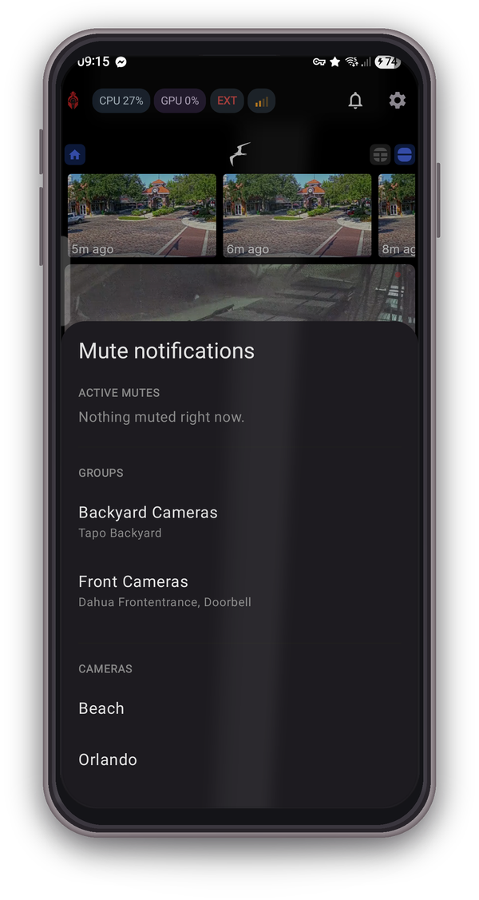
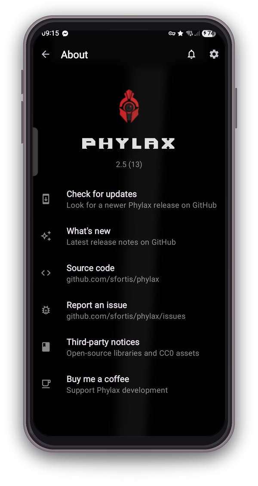

# Phylax

**Viewer for [Frigate NVR](https://frigate.video/) with smart URL switching and push-like notifications.**

 

_This app is an unofficial third-party client and is not affiliated with the Frigate NVR project._

---

## Table of Contents

- [What it does](#what-it-does)
- [Screenshots](#screenshots)
- [Install](#install)
- [Accessing Frigate as a Home Assistant add-on](#accessing-frigate-as-a-home-assistant-add-on)
- [How URL switching works](#how-url-switching-works)
- [Notifications](#notifications)
- [Mute notifications](#mute-notifications)
- [Live stats](#live-stats)
- [Downloads](#downloads)
- [Deep linking](#deep-linking)
- [Permissions](#permissions)
- [Requirements](#requirements)
- [Privacy](#privacy)
- [Support](#support)
- [License](#license)

## What it does

Phylax makes your self-hosted Frigate NVR feel like a proper mobile app.

- **Auto-switches between home and remote URLs** based on your Wi-Fi. No VPN, no manual toggles.
- **Reliable push-style notifications** with snapshot thumbnails. Tap a notification and you land right on the event.
- **Live system health at a glance.** CPU and GPU load in the top bar, tap for per-camera FPS and detector inference.
- **Fine-grained notification filters** by camera, zone and severity. One notification per event, never a spam flood.
- **Mute cameras or groups on the fly.** Tap the bell in the toolbar to silence noisy cameras or whole zones without diving into Settings.
- **Secure by default.** Supports client certificates (mTLS) for Cloudflare Access / nginx setups, self-signed certs on LAN.
- **Two-way talk** on doorbell and intercom cameras, with the phone's call-quality audio path engaged for clearer voice.

## Screenshots

  
  
  

  
  
  

  

## Install

Tap the **Get it on Obtainium** badge at the top with [Obtainium](https://github.com/ImranR98/Obtainium) installed for one-tap subscribe and auto-update, or grab the latest signed APK from the [Releases page](https://github.com/sfortis/phylax/releases/latest).

First-run setup:
1. Open **Settings → Connection** and enter your internal URL (e.g. `https://frigate.home.lan`) and external URL (e.g. `https://frigate.example.com`).
2. Under **Network mode** leave on **Auto** and add your home Wi-Fi SSIDs.
3. If your Frigate requires auth, enter username + password under **Frigate Account**.
4. If you use mTLS behind Cloudflare Access / nginx, import your `.p12` certificate under **Client certificate (mTLS)**.
5. Enable **Notifications** and grant **Ignore battery optimizations** when prompted.

## Accessing Frigate as a Home Assistant add-on

The Home Assistant Frigate add-on ships with the authenticated web UI on port **8971**, but that port is **not exposed by default**. Phylax needs a reachable URL, so you have to publish it once:

1. In Home Assistant, open the Frigate add-on **Configuration** tab and map port `8971` to the host.
2. Restart the add-on and confirm the UI loads at `https://<your-ha-ip>:8971`. Your browser will warn about the self-signed certificate; that warning is expected and safe to accept on your local network.
3. Use that same URL as your **Internal URL** in Phylax under Settings → Connection.

Frigate generates a random `admin` password on first install and prints it once to the add-on logs. Either grab that password from the logs, or create a dedicated Frigate user from the Frigate UI, then enter the credentials in Phylax under **Frigate Account**.

## How URL switching works

| Connection mode | Behavior |
|---|---|
| **Auto** | SSID in your home list: Internal URL. Anything else (cellular, guest Wi-Fi, airport): External URL. |
| **Internal** | Always Internal, regardless of network. |
| **External** | Always External. Useful for debugging remote access from home. |

The **INT / EXT** badge shows the active URL mode (orange text for internal, red for external on a neutral dark capsule). Next to it, a **cellular-style signal badge** reports reachability: 4 bars (green at or below 50 ms), 3 bars (green at or below 150 ms), 2 bars (amber at or below 300 ms), 1 bar (red above 300 ms), or **ERROR** if validation fails. Latency is re-probed every 5 seconds while Home is foreground; a 24-sample rolling history feeds the status popup graph.

## Notifications

The background `FrigateAlertService` keeps a `wss://.../ws` connection open and subscribes to the `reviews` channel — Frigate's curated, server-filtered notification feed (false positives, sub-threshold scores and per-camera notify rules are applied before a review is emitted).

- **Alert** (severity `alert`) and **Detection** (severity `detection`): tap opens `/review?id=<review_id>`.
- **Dedupe per review id.** The `new → update → end` lifecycle collapses to exactly one notification.
- **Zone filter.** Reviews without matching zones are dropped for cameras where you've allow-listed zones.
- **Reliable wake-up.** Alerts ring through Do Not Disturb at alarm volume even on Samsung One UI's vibrate ringer mode, routed via `STREAM_ALARM`. Music ducks (lowers volume briefly) instead of pausing.
- **Custom bundled tones** (CC0) registered with MediaStore as **Phylax Alert** / **Phylax Chime** so they show up by name in the system sound picker — switchable from Settings → Notifications → Sounds.

### Android 14+ reliability

| Technique | Purpose |
|---|---|
| `FOREGROUND_SERVICE_TYPE_SPECIAL_USE` | Sidesteps the 6-hour cap imposed on `DATA_SYNC` foreground services |
| Partial WakeLock | Keeps CPU scheduling the WebSocket ping loop during doze |
| WifiLock (high-perf) | Prevents Wi-Fi radio power-save from dropping the socket |
| Network callback kick | Forces a reconnect on network regain instead of waiting for exponential backoff |
| 15-min WorkManager watchdog | Revives the service if an OEM kills it (Samsung, MIUI, Honor) |
| Repost-on-dismiss receiver | Restores the persistent notification within ~1 s if the user swipes it away |

## Mute notifications

The bell icon in the toolbar opens a bottom sheet listing every camera and Frigate `groups` defined in your config. Tap to silence; tap again to unmute. Mutes are persisted locally and respected by `FrigateAlertService` — muted streams drop reviews before they hit the notification channel, so DND-bypassing alerts stay silent too.

## Live stats

Both the top-bar badges and the full stats panel are fed by Frigate's `/api/stats` endpoint, polled every 2 seconds while the activity is visible. Parsing tolerates Frigate 0.13 / 0.14 / 0.15+ schema drift (`cpu_usages`, `gpu_usages` vs legacy `gpus`, percent-suffixed string values, nested `service.uptime`).

The stats panel surfaces:

- CPU and GPU cards with progress bars and 3-tier tint: muted (idle), amber at or above 50 %, red at or above 75 %.
- RAM chip, uptime chip.
- Per-detector inference time.
- Per-camera capture FPS and detection FPS.

If polling fails, the badges dim after 10 seconds instead of lying bright.

## Downloads

Video clips and snapshots from Frigate:

- Works on both internal (self-signed) and external networks.
- Configurable destination: `Downloads/Frigate` (default), Pictures, Movies, or Downloads root.
- Progress notifications with an **Open** action on completion.

## Deep linking

The app registers the `frigate://` scheme.

| URI | Opens |
|---|---|
| `frigate://home` | Camera grid |
| `frigate://settings` | Settings root |
| `frigate://review/<id>` | Specific review segment |
| `frigate://event/<id>` | Specific event in Explore view |
| `frigate://camera/<id>` | Specific camera (planned) |

## Permissions

Minimum viable set. Nothing else is requested.

| Permission | Why |
|---|---|
| `INTERNET`, `ACCESS_NETWORK_STATE`, `ACCESS_WIFI_STATE` | Base connectivity |
| `ACCESS_FINE_LOCATION` | Required to read SSID on Android 13–16 (callback `WifiInfo` is otherwise redacted to `<unknown ssid>`). Used only for auto-switching, never sent off-device |
| `RECORD_AUDIO`, `MODIFY_AUDIO_SETTINGS` | Two-way talk to doorbell / intercom cameras |
| `POST_NOTIFICATIONS` | Alerts and detections |
| `ACCESS_NOTIFICATION_POLICY` | Lets the alerts channel bypass Do Not Disturb (granted by you in System Settings, not on install) |
| `FOREGROUND_SERVICE` + `FOREGROUND_SERVICE_SPECIAL_USE` | Alert listener lifetime |
| `RECEIVE_BOOT_COMPLETED` | Re-start the listener after reboot |
| `WAKE_LOCK` | Keep the WebSocket ping loop alive during doze |
| `REQUEST_IGNORE_BATTERY_OPTIMIZATIONS` | Optional, prompted once on notification enable |
| `REQUEST_INSTALL_PACKAGES` | In-app updater from GitHub releases |

## Requirements

- Android 10 (API 29) minimum, Android 13+ recommended.
- Frigate NVR with local and / or remote access. Notifications require Frigate **0.13+** (the review system that emits the curated notification feed over `/ws`). Stats parsing supports 0.13 through 0.17.

## Privacy

- **Viewer only.** All processing happens on your Frigate server. No cloud relay, no analytics, no telemetry, no crash reporting.
- **Local storage only.** Session cookies and the `frigate_token` live in app-private storage. The Frigate account password is kept in `EncryptedSharedPreferences`.
- **No ads.**
- **Open source.** Auditable end to end.

## Support

If Phylax made your life easier and you'd like to say thanks, a coffee goes a long way towards keeping the app maintained. No pressure. Bug reports and PRs are equally welcome.

## License

MIT. See [LICENSE](LICENSE).
